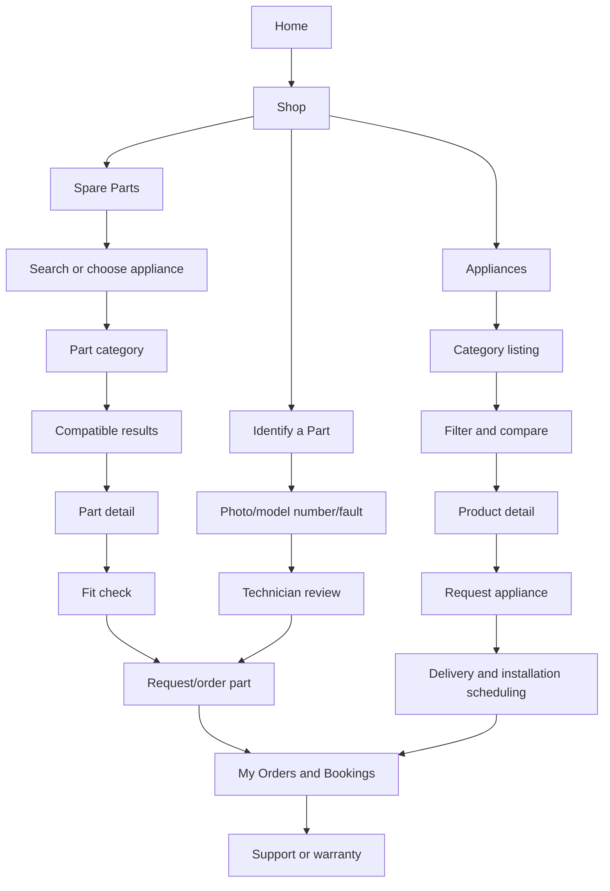

# Fixxer Shop: Mobile-First UX and Flow Architecture

**Status:** Proposed
**Audience:** Product, design, frontend, backend, operations
**Scope:** Spare parts and complete appliances
**Primary market assumption:** Mobile-first customers in Patna and Bihar who need a working appliance quickly and may not know the exact part or model name.

## 1. Product direction

Fixxer Shop should feel like a trusted local appliance expert with marketplace convenience. It should not behave like a smaller copy of a general e-commerce catalog.

The two catalog areas have different customer jobs:

| Area | Customer job | Main uncertainty | Best conversion action |
| --- | --- | --- | --- |
| Spare parts | Get the correct replacement part | "Will this fit my appliance?" | Verify fit, then request/order |
| Appliances | Choose and get a complete unit installed | "Which model is right and what happens after payment?" | Compare, enquire, schedule installation |

### Recommendation

Build one shared **Fixxer Shop** experience with two purpose-built funnels:

1. **Parts Finder:** appliance -> brand/model -> fault or part category -> compatible parts -> assisted order.
2. **Appliance Store:** category -> filters -> compare -> product detail -> enquiry and installation scheduling.

This borrows useful patterns from Urban Company (guided intent, trust, service follow-through) and Flipkart (search, filters, comparison, order tracking), while keeping the core Fixxer advantage: a technician can validate the choice and complete the job.

## 2. Experience principles

1. **Start with the customer's problem.** Offer "I know the part" and "I need help identifying it" as equally visible paths.
2. **Compatibility before persuasion.** A low price is not useful if the part is wrong. Fit confidence must appear before the primary CTA.
3. **One primary action per screen.** Secondary actions remain available but visually quiet.
4. **Assisted commerce is a feature.** WhatsApp, call, technician help, and enquiry are not failure states; they are valid conversion paths.
5. **Show the next operational step.** For both parts and appliances, explain delivery, installation, confirmation, and support before the customer submits.
6. **Preserve context.** Search terms, filters, selected model, and enquiry items must survive navigation and authentication.
7. **Use progressive disclosure.** Summary first, technical detail on demand, full history after purchase.

## 3. Proposed information architecture



### Navigation model

Keep the existing mobile bottom navigation, but make Shop the central commerce entry point:

| Tab | Destination | Role |
| --- | --- | --- |
| Home | `/` | Discovery and urgent repair entry |
| Services | `/services` | Book a repair directly |
| Book | Booking modal | High-intent service action |
| Shop | Shop switcher | Spare parts, appliances, identify a part |
| Bookings | `/my-bookings` | Orders, repairs, appliance installation, warranty |

The current `/spare-parts` and `/spare-parts/appliances` URLs should remain valid. The shared shell can be introduced without a disruptive URL migration.

## 4. Core user flows

### Flow A: Customer knows the part

1. Open Shop > Spare Parts.
2. Search by part name, SKU, brand, appliance, or model number.
3. Select a result or category.
4. Review fit, price, stock, warranty, delivery estimate, and installation option.
5. Run the fit check: select appliance brand/model or confirm universal fit.
6. Add one or more parts to the request basket.
7. Enter delivery/contact details once.
8. Submit the order request.
9. See confirmation with reference number, expected response time, and next step.

### Flow B: Customer does not know the part

1. Open Shop > Identify a Part.
2. Choose appliance type.
3. Add model number, appliance photo, part photo, or describe the fault.
4. Add location and preferred contact method.
5. Submit a technician-assisted identification request.
6. Track it in My Bookings under **Part Help**.
7. Approve the suggested part and price from the request detail screen.

This is the most important Fixxer-specific flow. It prevents customers from abandoning because they cannot translate a repair problem into a catalog term.

### Flow C: Customer buys an appliance

1. Open Shop > Appliances.
2. Select category, currently Air Conditioners.
3. Apply compact filters: capacity, inverter, star rating, type, price, availability.
4. Compare up to three products.
5. Open a product detail page.
6. Review price, installation inclusion, warranty, delivery area, specifications, and total next steps.
7. Submit an appliance enquiry with quantity and preferred installation slot.
8. Receive confirmation that Fixxer will verify stock and schedule delivery/installation.
9. Track the order and installation timeline in My Bookings.

### Flow D: Customer comes from a repair

1. A repair booking is marked uneconomical, obsolete, or replacement recommended.
2. Customer sees a contextual action: **See replacement appliances**.
3. The appliance category, brand, and service location are prefilled.
4. Customer compares suitable products.
5. The original repair context remains visible in the enquiry.

## 5. Mobile screen architecture

### Shared Shop shell

Every Shop screen should use the same structure:

1. Compact top bar: back, Fixxer Shop label, search, and request basket/order count.
2. Context rail: current category or appliance type, horizontally scrollable.
3. Main content: one clear task per screen.
4. Sticky bottom action only when the next action is unambiguous.
5. Bottom navigation remains visible except during focused form steps.

Avoid stacking the current global header, a second large hero, and a third navigation rail on small screens. The shop should become task-focused after entry.

### Shop home

Above the fold:

- Search field: `Search parts, appliances, or model number`
- Two large intent cards: **Find a spare part** and **Shop appliances**
- A smaller text action: **Send a photo, we will identify the part**
- Recent searches or open requests for signed-in customers

Below the fold:

- Popular parts
- Appliance categories
- Trust strip: genuine parts, technician support, installation, warranty

### Spare parts results

Use a two-stage layout:

**Stage 1: Identify**

- Appliance type chips
- Brand chips
- Model number input with `I do not know my model` escape hatch
- Part category grid

**Stage 2: Results**

- Result count and sort
- Filter button opening a bottom sheet
- Compatibility status on every card: `Fits your model`, `Check fit`, or `Universal`
- Price and availability
- Optional `Install with Fixxer` label

The existing URL state (`type`, `cat`, `brand`, `q`, `universal`) is a good foundation. Add model context rather than replacing it.

### Spare part detail

Order of information on mobile:

1. Image and part name
2. Compatibility result, not a generic badge
3. Price, stock, delivery estimate
4. Warranty and installation option
5. Compatible models and part number
6. Description and technical details
7. Related parts or technician help

Primary CTA states:

- `Add to request`
- `Check compatibility`
- `Ask a technician`
- `Out of stock - request availability`

The CTA should never say `Get Best Price` when a numeric price is already known. Use the enquiry route for assisted conversion, but make the action explicit.

### Appliance listing

On mobile, keep cards scannable rather than dense:

- Product image
- Brand and model
- 2-3 high-signal specs
- Price or `Request current price`
- Installation included/not included
- Warranty summary
- Compare control

Filters open as a bottom sheet with Apply and Clear actions. Preserve filters in the URL so a shared link reproduces the same listing.

### Appliance detail

Use a sticky summary bar with product name, price, and enquiry CTA. The content order should be:

1. Gallery and product title
2. Total cost framing: product, installation, delivery, and what is confirmed later
3. Key specs
4. Why this model may fit the customer
5. Installation and warranty
6. Full specifications
7. Frequently asked questions
8. Similar products

Do not hide installation information inside a long specification table. It is a purchase decision factor for Fixxer.

### Enquiry and checkout-like form

The current enquiry form asks for too much at once. Convert it into a short three-step flow:

**Step 1: Selection**

- Part or appliance summary
- Quantity
- Add another part for spare-parts requests

**Step 2: Contact and location**

- Name
- Phone
- Address or pincode
- Email as optional unless operationally required

**Step 3: Timing and confirmation**

- Preferred date/time
- Notes or photo upload
- Price and availability disclosure
- Submit request

Show a progress indicator, preserve draft data, and authenticate by phone without losing the form.

### My Bookings / Orders

Use one account surface with tabs or segmented controls:

- Repairs
- Parts
- Appliances
- Part Help

Each item gets a detail route in the future. The list card should show status, last update, amount state, next action, and support shortcut. For appliances, the status timeline should be:

`Request received -> Stock confirmed -> Delivery scheduled -> Installation scheduled -> Installed`

For parts:

`Request received -> Fit/stock verified -> Price shared -> Approved -> Dispatched/ready -> Completed`

## 6. Component architecture

Create a shared shop layer rather than duplicating parts and appliance patterns.

```text
app/components/shop/
  ShopShell.tsx
  ShopHeader.tsx
  ShopIntentCards.tsx
  ShopContextRail.tsx
  ShopStickyAction.tsx
  CompatibilityBadge.tsx
  TrustStrip.tsx
  RequestBasket.tsx
  RequestStepper.tsx
  OrderStatusTimeline.tsx
  HelpIdentifyPartCard.tsx

app/components/spare-parts/
  PartsFinder.tsx
  PartsFilterSheet.tsx
  PartsResultCard.tsx
  CompatibilityCheck.tsx

app/components/appliances/
  ApplianceFilterSheet.tsx
  ApplianceCompareTray.tsx
  AppliancePriceSummary.tsx
  InstallationSummary.tsx
```

### State ownership

| State | Owner | Persistence |
| --- | --- | --- |
| Search, filters, category, model context | URL search params | Shareable and browser history |
| Request basket | Shop context | Session storage, then server after authentication |
| Enquiry step and draft fields | Request form context | Session storage until submit |
| Authenticated orders and status | API/query layer | Server source of truth |
| Compare list | Local shop context | Memory or session storage |

Do not put filter state, selected product, or request draft only in component-local state. Back navigation and authentication currently risk losing customer intent.

## 7. Data and API additions

The existing APIs can support the first release, with these additions recommended:

### Compatibility

```text
GET /spare-parts/compatibility?partId=...&applianceType=...&brand=...&model=...
-> { status, confidence, label, matchedModel, reasons, alternatives }
```

Possible labels: `MATCH`, `UNIVERSAL`, `PARTIAL`, `UNKNOWN`, `NO_MATCH`.

### Assisted identification

```text
POST /part-help-requests
  { applianceType, brand, modelNumber, faultDescription, imageUrls, address, phone }
GET /user/part-help-requests
GET /user/part-help-requests/:id
POST /user/part-help-requests/:id/approve
```

### Shop request/order

Keep `POST /part-orders` as the submission contract initially. Add a normalized response containing:

- `referenceNumber`
- `orderType`
- `status`
- `nextAction`
- `estimatedResponseAt`
- `priceState` (`KNOWN`, `RANGE`, `PENDING_CONFIRMATION`)
- `installationState` for appliances

### Customer detail routes

Add customer-safe detail endpoints for the current list-only experience:

```text
GET /user/part-orders/:id
GET /user/bookings/:id
```

This enables deep links from notifications and gives each order a proper timeline, cancellation rule, invoice, warranty, and support entry point.

## 8. Trust and copy rules

Use direct, operational copy:

- `Fits your selected model` instead of `Premium compatibility`
- `We will confirm stock before charging` instead of `Fast checkout` when the flow is enquiry-based
- `Installation included` or `Installation quoted separately`, never an ambiguous `Installation available`
- `Price confirmed after fit and stock check` when the price is not final
- `Warranty starts after installation/completion` where that is the actual rule

Every product card and detail screen should answer four questions before the CTA:

1. Is it the right item?
2. What will it cost?
3. When can I get it or have it installed?
4. What happens if it is wrong or fails?

The existing pricing and warranty fix plan should be treated as a dependency. The Shop UI must not introduce new promises or conflicting warranty durations.

## 9. Empty, error, and edge states

Design these as first-class screens, not toast messages:

| State | Customer-facing action |
| --- | --- |
| No search results | Clear filters, browse categories, or ask a technician |
| Unknown model | Upload photo or enter fault description |
| Compatibility unknown | Request a fit check before submitting |
| No delivery area | Enter another pincode or contact support |
| Out of stock | Request availability or see compatible alternatives |
| Network/API failure | Retry without losing search or form state |
| Auth interruption | Continue with phone and restore the draft |
| Duplicate request | Open the existing request instead of silently creating another |

## 10. Success metrics

Measure the funnel separately for parts and appliances.

### Spare parts

- Search-to-compatible-result rate
- Compatibility check completion rate
- Part detail to request-basket rate
- Assisted identification completion rate
- Wrong-part cancellation rate
- Time from request to fit/price confirmation

### Appliances

- Category-to-detail rate
- Filter usage and compare usage
- Detail-to-enquiry rate
- Enquiry-to-stock-confirmed rate
- Installation scheduling completion rate
- Enquiry cancellation reasons

### Shared

- Shop entry to submitted request
- Form abandonment by step
- Returning customer request completion
- Support contact rate after submission
- Core Web Vitals on mobile

## 11. Implementation plan

### Phase 1: Clarify and stabilize the shell

- Add the shared Shop home and `Identify a Part` entry point.
- Keep current routes and query parameters working.
- Consolidate mobile header, context rail, sticky action, and trust components.
- Change the enquiry form to a 3-step flow while preserving the current `POST /part-orders` payload.
- Add analytics events for entry, search, filter, detail, CTA, and submit.

### Phase 2: Make parts confidence-led

- Add model context to URL and request state.
- Add compatibility badge and fit-check component.
- Add request basket for multiple parts.
- Add assisted identification request and a Part Help tab in My Bookings.
- Add customer order detail route.

### Phase 3: Make appliances comparison-led

- Add compare tray for up to three products.
- Add installation and total-cost summary.
- Add appliance order timeline and scheduling state.
- Add recommendations from a repair booking.

### Phase 4: Operational feedback loop

- Track fit failures and enquiry reasons.
- Use technician-confirmed model/part matches to improve search synonyms and compatibility data.
- Add notification deep links to order detail and approval actions.

## 12. Definition of done for the first release

- A new mobile user can reach either spare parts or appliances from one Shop entry point.
- A parts user can proceed without knowing the exact part name.
- A parts user can see whether fit is confirmed, unknown, or universal before submitting.
- An appliance user can compare key models and understand installation responsibility.
- The enquiry form does not require a long single-screen data dump.
- Search/filter/model context survives back navigation and authentication.
- Every submitted request has a reference number, status, next action, and support path.
- Existing `/spare-parts` and appliance routes continue to work during rollout.

## Final recommendation

Position Fixxer Shop as **"the fastest way to get the right appliance solution"**, not merely a catalog. The differentiator is the bridge between commerce and service: customers can search like Flipkart, get guided confidence like Urban Company, and finish with a Fixxer technician when the problem is too ambiguous for self-service.
